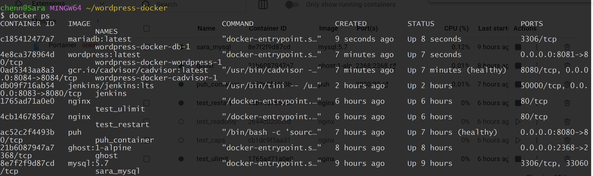
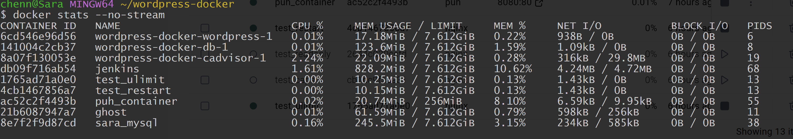
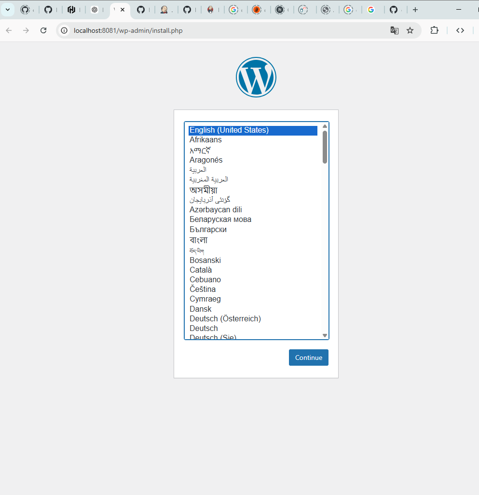

# M300 – WordPress als Web‑Dienstleistung

## 1. Ziel des Projekts
In diesem Projekt wurde eine containerisierte Webhosting‑Umgebung mit Docker aufgebaut. 
Ziel war es, eine reproduzierbare und einfach wartbare Umgebung für eine Website bereitzustellen.

Die Umgebung besteht aus drei Containern:

- WordPress (Webserver)
- MariaDB (Datenbank)
- cAdvisor (Monitoring)

---

# 2. Projektstruktur

```
wordpress-docker
│
├─ docker-compose.yml
├─ .env
└─ images
```

---

# 3. .env Datei

```
MYSQL_DATABASE=wordpress
MYSQL_USER=wpuser
MYSQL_PASSWORD=secret
MYSQL_ROOT_PASSWORD=admin
```

---

# 4. docker-compose.yml

```yaml
services:

  db:
    image: mariadb:latest
    restart: unless-stopped
    environment:
      MYSQL_DATABASE: ${MYSQL_DATABASE}
      MYSQL_USER: ${MYSQL_USER}
      MYSQL_PASSWORD: ${MYSQL_PASSWORD}
      MYSQL_ROOT_PASSWORD: ${MYSQL_ROOT_PASSWORD}
    volumes:
      - db_data:/var/lib/mysql
    networks:
      - wpnet

  wordpress:
    image: wordpress:latest
    restart: unless-stopped
    depends_on:
      - db
    ports:
      - "8081:80"
    environment:
      WORDPRESS_DB_HOST: db:3306
      WORDPRESS_DB_NAME: ${MYSQL_DATABASE}
      WORDPRESS_DB_USER: ${MYSQL_USER}
      WORDPRESS_DB_PASSWORD: ${MYSQL_PASSWORD}
    volumes:
      - wp_data:/var/www/html
    networks:
      - wpnet

  cadvisor:
    image: gcr.io/cadvisor/cadvisor:latest
    ports:
      - "8080:8080"
    networks:
      - wpnet

volumes:
  db_data:
  wp_data:

networks:
  wpnet:
```

---

# 5. Container starten

```
docker compose up -d
```

Container prüfen:

```
docker ps
```

Bild einfügen:

---

# 6. Zugriff

WordPress  
http://localhost:8081

cAdvisor  
http://localhost:8080

---

# 7. Monitoring

cAdvisor zeigt:

- CPU Nutzung
- RAM Nutzung
- Netzwerk

Bild:


---

# 8. Ressourcen prüfen

```
docker stats
```

Bild:


---

# 9. Volume Test

Container neu starten:

```
docker compose down
docker compose up -d
```

WordPress Beitrag bleibt erhalten.

Bild:


---

# 10. Fehleranalyse

Fehler:

Error establishing a database connection

Bild:


Ursache:

Falscher Host (localhost).

Lösung:

```
db:3306
```

Container neu starten.

---

# 11. Fazit

Docker ermöglicht eine reproduzierbare und stabile Umgebung für Webanwendungen.
WordPress, MariaDB und Monitoring können einfach verwaltet und überwacht werden.
